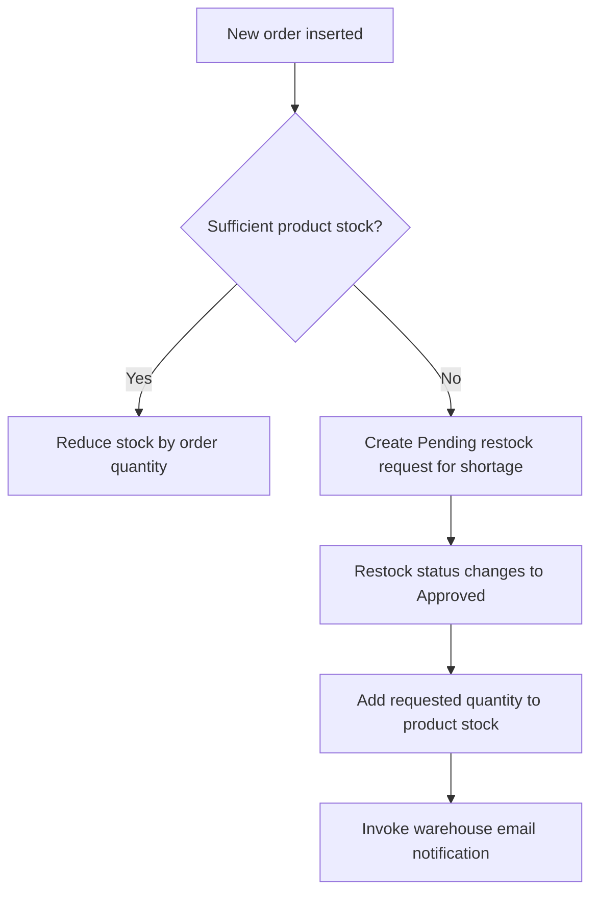

# RePlastix-Innovations-Transforming-Plastic-Waste-into-Sustainable-

## Project Overview

Replastix is a Salesforce application developed as part of the SkillWallet project **Re Plastic Innovations**. It manages plastic waste collections, recycling centers, recycled products, customer orders, and restock requests in one application.

The project supports an eco-friendly approach to recycling plastic waste into sustainable products, promoting a circular economy through organized collection records and inventory management.

## Key Features

- Track plastic waste by weight, type, collection date, status, location, and recycling center.
- Maintain recycling center locations and processing capacities.
- Manage recycled product stock, minimum stock thresholds, and prices.
- Link customer orders to Accounts and recycled products.
- Automatically reduce stock when sufficient inventory exists for a new order.
- Create a Pending restock request for the missing quantity when stock is insufficient.
- Increase inventory when a restock request changes to Approved.
- Configure warehouse email notifications and daily low-stock follow-up Tasks.
- Manage access through roles, profiles, organization-wide defaults, and sharing rules.
- Validate order quantities and waste collection dates.

## Technology Stack

| Technology | Purpose |
| --- | --- |
| Salesforce Developer Edition | Development environment |
| Custom Objects and Lookup Relationships | Data storage and relationships |
| Salesforce Lightning App | Navigation and record management |
| Flow Builder | Daily low-stock Task automation |
| Apex Classes and Triggers | Inventory and restock processing |
| SOQL | Query related product and user records |
| Formula Fields and Validation Rules | Inventory visibility and data checks |
| Apex Test Classes | Automated verification of stock behavior |

## Data Model

The application uses five custom objects.

| Custom Object API Name | Key Fields |
| --- | --- |
| `Re_Plastic_Innovations_Plastic_Waste__c` | Weight, Type, Collection Date, Status, Recycling Center, Location |
| `Re_Plastic_Innovations_Recycling_Center__c` | Name, Location, Capacity |
| `Re_Plastic_Innovations_Recycled_Product__c` | Name, Stock Level, Threshold, Price, Stock Low On Product |
| `Re_Plastic_Innovations_Order__c` | Order Number, Account, Product, Quantity, Delivery Date |
| `Re_Plastic_Innovations_Restock_Request__c` | Request Number, Product, Requested Quantity, Status |

### Lookup Relationships

- Plastic Waste → Recycling Center through `Recycling_Center__c`.
- Order → Account through `Account__c`.
- Order → Recycled Product through `Product__c`.
- Restock Request → Recycled Product through `Product__c`.

**Implementation note:** The Order object uses `Account__c` and `Product__c`. These are the actual field API names used by the Apex implementation, replacing the original guide references to `Customer__c` and `Recycled_Product__c`.

### Important Picklist Values

| Field | Values |
| --- | --- |
| Plastic Waste Type | PET, HDPE, PVC, LDPE, PP, PS, Other |
| Plastic Waste Status | Collected, Processing, Recycled |
| Restock Request Status | Pending, Approved, Completed |

## Inventory Workflow



For an insufficient-stock order, existing stock remains unchanged. Restock approval replenishes inventory; it does not automatically fulfill the original order.

## Apex Components

| Component | Responsibility |
| --- | --- |
| `InventoryManager` | Deduct sufficient stock, create shortage requests, and add approved restock quantities |
| `UpdateStockAfterOrder` | Invoke order processing after an Order is inserted |
| `UpdateStockAfterRestockApproval` | Process a Restock Request when its status transitions to Approved |
| `EmailNotificationHelper` | Invoke notifications for active Warehouse Supervisor users with an email address |
| `InventoryManagerTest` | Test stock deductions, shortages, approval handling, and skipped inputs |

The implementation uses collections and SOQL queries outside record-processing loops. Product updates are collected by product ID to avoid duplicate IDs in the update operation.

## Daily Low-Stock Flow

The **Stock Level Is Low** schedule-triggered Flow is configured to run daily at **6:00 AM**, using the organization's time zone.

### Decision Condition

```text
Stock_Level__c < Threshold__c
```

When the condition is true, the Flow creates a Task with the following values:

| Task Field | Value |
| --- | --- |
| Assigned To | Product owner |
| Related To | Recycled Product record |
| Priority | High |
| Status | In Progress |
| Subject | Please Look in this Stock Is Low Fill The Stock ASAP |

The default outcome ends without creating a Task.

This Flow creates follow-up Tasks. Restock requests for order shortages are created separately by the Apex order handler.

## Formula Field

### Stock Low On Product

A Text formula on the Recycled Product object displays the inventory status.

```text
IF(
    Stock_Level__c < Threshold__c,
    "Low Stock - Restock Needed",
    "Sufficient Stock"
)
```

| Stock Level | Threshold | Output |
| --- | --- | --- |
| 5 | 10 | Low Stock - Restock Needed |
| 15 | 10 | Sufficient Stock |
| 10 | 10 | Sufficient Stock |

The formula displays a status message; it does not change inventory or create records.

## Validation Rules

### Order Quantity Validation

- **Object:** Re Plastic Innovations Order
- **Rule Name:** `Check_Quantity_Not_Zero`
- **Error Condition:** `Quantity__c <= 0`
- **Error Message:** Quantity must be greater than zero.
- **Error Location:** Quantity field

### Collection Date Validation

- **Object:** Re Plastic Innovations Plastic Waste
- **Rule Name:** `Future_Date_Collection`
- **Error Condition:** `Collection_Date__c > TODAY()`
- **Error Message:** Collection Date cannot be in the future.
- **Error Location:** Collection Date field

## Access Configuration

### Role Hierarchy

| Role | Reports To |
| --- | --- |
| Recycling Manager | CEO |
| Sales Representative | CEO |
| Warehouse Supervisor | Sales Representative |

### Custom Profiles

Three profiles were created by cloning **Standard Platform User**.

| Profile | Project Object Permissions |
| --- | --- |
| Platform 1 | Read/Create on Plastic Waste; Read on Restock Request |
| Platform 2 | Read/Create on Order and Account; Read on Plastic Waste and Recycled Product |
| Platform 3 | Read/Create/Edit configured for Plastic Waste; equivalent grants for the other four custom objects were deferred |

### Sharing Rules

Private organization-wide defaults were used for Plastic Waste, Recycled Product, and Restock Request.

| Object | Record Owner Role | Shared With | Access |
| --- | --- | --- | --- |
| Plastic Waste | CEO | Recycling Manager | Read Only |
| Recycled Product | CEO | Sales Representative | Read Only |
| Restock Request | Sales Representative | Warehouse Supervisor | Read Only |

Sharing rules extend record access. Users also need the corresponding object and field permissions.

## Lightning Application

The **Re Plastic Innovations** Lightning app provides navigation to:

- Plastic Wastes
- Recycling Centers
- Recycled Products
- Orders
- Restock Requests

The app was created through App Manager and assigned to the System Administrator profile during configuration.

## Setup Summary

1. Open a Salesforce Developer Edition org with administrator access.
2. Create the five custom objects, fields, and lookup relationships using the documented API names.
3. Create the custom tabs and the **Re Plastic Innovations** Lightning app.
4. Configure the project roles, profiles, users, and sharing settings.
5. Add the stock formula and both validation rules.
6. Save `InventoryManager` and `EmailNotificationHelper`.
7. Save the dependent Order and Restock Request triggers.
8. Create and activate the **Stock Level Is Low** Flow.
9. Save and run `InventoryManagerTest` in Developer Console.
10. Verify inventory changes, restock approval, user access, scheduled Tasks, and notification emails.

The project was built through Salesforce Setup and Developer Console. Recreating it in another org requires the documented metadata and source code.

## Testing

| Test Scenario | Expected Result |
| --- | --- |
| Stock 50; new order quantity 20 | Stock becomes 30; no restock request |
| Stock 50; new order quantity 150 | Stock remains 50; Pending request for 100 |
| Approve the request for 100 | Stock becomes 150 |
| Save the same Approved request again | Stock remains 150 |
| Order quantity 0 | Validation error |
| Future collection date | Validation error |
| Stock below threshold | Low-stock formula message |

**Final testing milestone:** 100% coverage for `InventoryManager` was reported after the test updates.

The tests cover stock reduction, shortage request creation, approval processing, unchanged Approved saves, and mixed valid and invalid handler inputs.

Apex coverage does not establish live email delivery, scheduled Flow execution, or user-access correctness. These require separate verification.

## Screenshots

Add final project screenshots under the following headings.

### 1. Lightning Application

*Insert a screenshot showing the app name and five object tabs.*

### 2. Objects and Relationships

*Insert screenshots showing field names, data types, API names, and lookup relationships.*

### 3. Roles, Profiles, and Sharing

*Insert screenshots of the role hierarchy, configured profile permissions, and sharing rules.*

### 4. Formula and Validation Rules

*Insert screenshots of the saved rules and their results on test records.*

### 5. Scheduled Flow

*Insert the active Flow canvas and, after verification, the actual generated Task.*

### 6. Order and Restock Processing

*Insert stock values before and after an order, the shortage request, and the approved restock result.*

### 7. Email Notification

*Insert the actual received notification after verifying email delivery.*

### 8. Apex Test Coverage

*Insert the latest passing test run and final code coverage screenshot.*

## Current Limitations

- Four Platform 3 object-permission grants remain deferred.
- Scheduled Task creation, actual email delivery, and complete sample-user access still require final evidence.
- Stock reconciliation for order edits, deletion, or cancellation is not implemented.
- An insufficient order does not reserve stock or automatically complete after replenishment.
- Changing an Approved request to another status and back to Approved can add stock again.
- Duplicate daily Tasks, concurrent stock updates, and production deployment are outside the completed scope.

## Future Enhancements

- Prevent duplicate restock processing and repeated follow-up Tasks.
- Reconcile inventory when orders are changed or cancelled.
- Add concurrency controls for simultaneous orders.
- Connect collected waste batches to finished products.
- Add dashboards for waste collection, inventory, and restock requests.
- Extend testing for user access and end-to-end automation.

## Author

**Hrushikesh Addepalli**

Developed as part of the **SkillWallet Salesforce learning project**.
